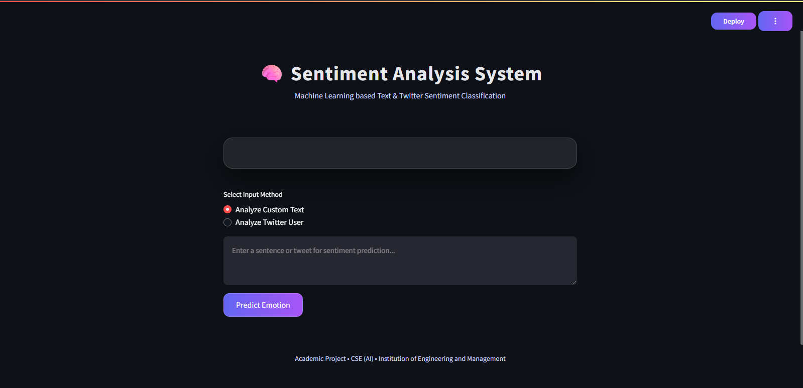
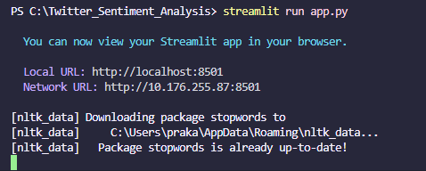

# Sentiment Analysis System

## 📌 Project Overview
The **Sentiment Analysis System** is a Machine Learning based application designed to analyze
and classify textual data into **Positive** or **Negative** sentiment.
The project applies concepts of **Natural Language Processing (NLP)** and
**Supervised Machine Learning** to understand user opinions expressed in text.

This project is developed as part of an academic requirement for the
**B.Tech CSE (Artificial Intelligence)** program.

---
## 📸 Project Screenshots

### Application Interface


### Sentiment Result


### Terminal Execution


---

## 🎯 Objectives
- To preprocess and clean raw textual data
- To remove noise such as stopwords and special characters
- To convert text into numerical features using **TF-IDF**
- To classify sentiment using a **Logistic Regression** model
- To provide an interactive web interface for sentiment prediction

---

## 🧠 Methodology
1. **Text Preprocessing**
   - Lowercasing
   - Removing special characters
   - Stopword removal using NLTK

2. **Feature Extraction**
   - TF-IDF Vectorization to transform text into numerical form

3. **Model Training**
   - Logistic Regression classifier trained on labeled sentiment data

4. **Prediction**
   - Input text is processed and classified as Positive or Negative

---

## 🛠 Technologies Used
- Python
- NLTK
- Scikit-learn
- Streamlit
- Pickle

---

## 🖥 Application Interface
The project includes a **Streamlit-based web interface** where users can:
- Enter custom text
- Analyze sentiment instantly
- View results in a simple and user-friendly UI

---

## ▶ How to Run the Project
```bash
pip install streamlit nltk scikit-learn
streamlit run app.py
